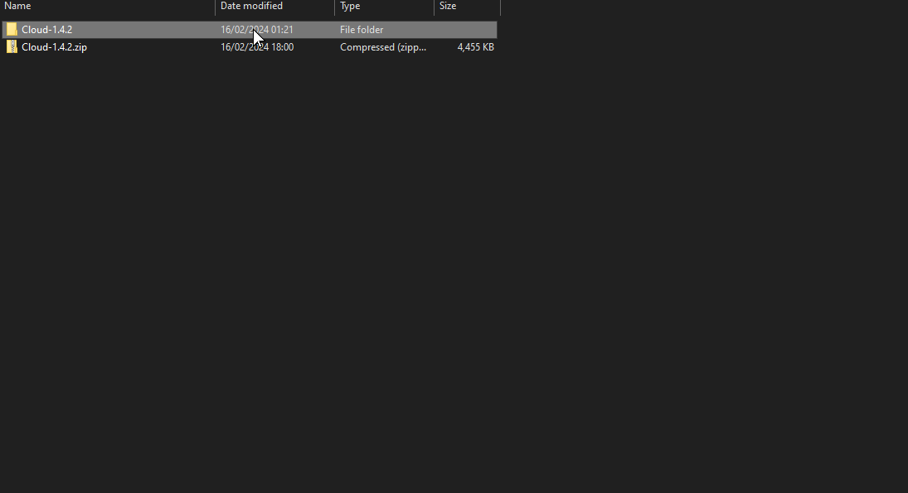

---
layout:
  title:
    visible: true
  description:
    visible: false
  tableOfContents:
    visible: true
  outline:
    visible: true
  pagination:
    visible: true
---

# 🗃 Unpacking the zip file

## Windows

### 7-Zip

Right-click (mouse2) on the downloaded zip file, hover over the "7-Zip" tab, and select "Extract here." Wait for the extraction process to complete, then double-click (open) the extracted folder.

<figure><figcaption>
Step 1
</figcaption></figure>

 

<figure><figcaption>
Step 2
</figcaption></figure>

 

<figure><figcaption>
Step 3
</figcaption></figure>

 

<figure><figcaption>
Step 4
</figcaption></figure>

 

<figure><figcaption>
Step 5
</figcaption></figure>

WinRAR

I avoid using WinRAR due to the abundance of ads and subscription prompts. However, I assume the extraction process is similar to that of 7-Zip, I also recommend you to use 7-Zip.
